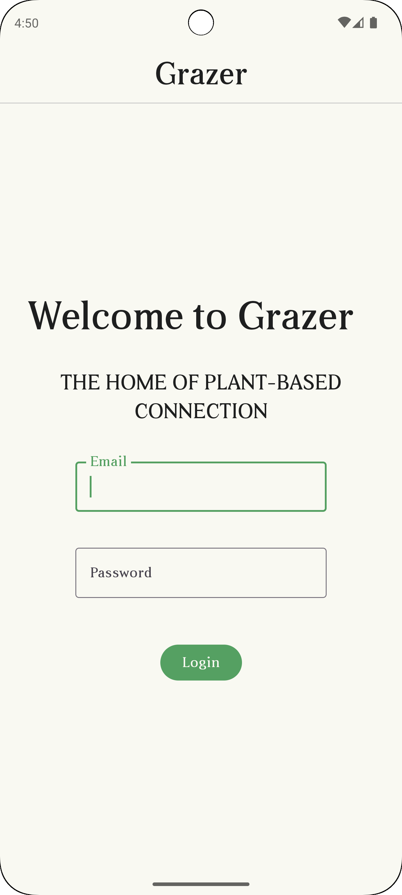
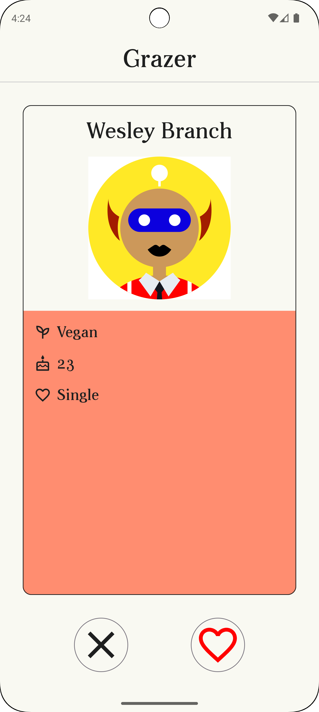
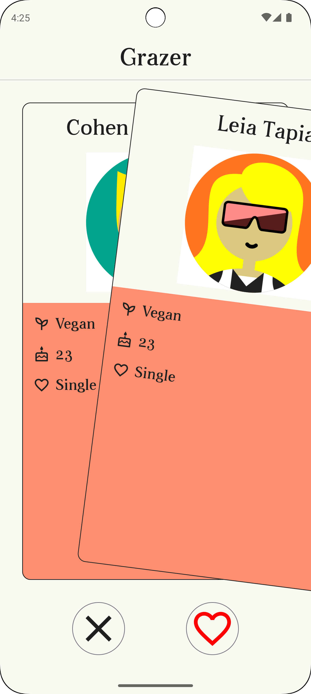

# Grazer

# Screenshots

| Login | List | Swipe UI |
| --- | --- | --- |
|  |  |  | 

# App architecture

This code base follows Clean Architecture. I have created separate Android modules for each distinct piece of functionality. 
For example the `login` module provides all of the auth/login functionality, along with the UI.

Each module follows this package structure:

* `data` (data storage/request)
  * `datasource` (mechanism)
    * `api` (retrofit etc.)
  * `repository` (handles data)
* `domain` (app logic)
  * `mapper` (converting data from data to domain layer)
  * `repository` (interface)
  * `usecase` (action the viewmodel wants to perform)
* `presentation` (where the ui goes)
  * screen classes (represents a screen)
  * compose classes for building up a screen
  * view models

# Libraries used

* Development/build system - `Kotlin`, `Gradle`
* UI - `Jetpack Compose`, `Material 3`
* Dependency injection - `Dagger Hilt`
* Network requests - `Retrofit`, `OkHttp`, `Coroutines`
* Animations - `Material3`, `Lottie`
* Code quality checks - `Kotlinter`, `detekt`, `Android lint`
* Testing - `JUnit 4/5`, `Mockk`, `Kluent`, `Mockito`
* UI Testing - `Espresso`

For the full list of libraries, please read the [gradle catalogue file](gradle/libs.versions.toml).

# App screens

The app consists of two screens:

1. `Login screen` - this allows the user to login to the fake Grazer API
2. `Users screen` - this shows the list of users returned by the Grazer API. Instead of displaying this in the UI as a list, I chose to use a swipe left/right UI that is a common pattern in dating apps.

# API requests

For the login screen the app makes a request to `https://grazer.nw.r.appspot.com/v1/auth/login`. In the request you must send an email and password. The API always returns a JWT auth token, regardless of what credentials you provide.

For the users screen the app makes a request to `https://grazer.nw.r.appspot.com/v1/users`. This provides a list of users with a name, date of birth (in the format of seconds since epoch) and a profile image url. It also provides meta data which I have chosen to not use at all.

# Pull request flow

No commits are allowed on the `main` branch. Everything must be done through pull requests.
Every pull request has 5 checks performed on it via GitHub actions to ensure that it is suitable to be merged. In a team I would expect someone else to review my work as well before it can be merged.
The 5 checks are:

* `Build` - this check that the PR builds successfully
* `Detekt` - this checks code formatting
* `Kotlinter` - this checks code formatting
* `Lint` - this checks general code quality
* `Unit tests` - this runs the unit tests

# Improvements

There are many ways this project can be improved:

* Add more unit tests
* Implement UI tests
* Implement screenshot testing
* Implement JWT refresh
* Improve swipe left/right UI
* Fix UI bugs with login screen
* Fix UI bugs with Lottie animation